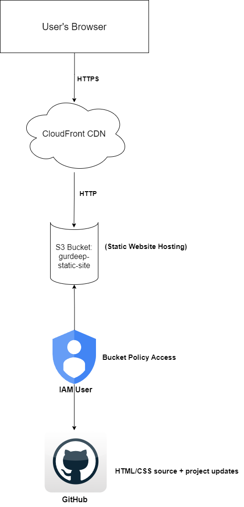

# 🌐 Static Website Hosting on AWS with CloudFront CDN

This project demonstrates how to deploy a static HTML website on **Amazon S3**, make it publicly accessible via bucket policies, and accelerate delivery using **CloudFront CDN**. The project is part of my hands-on learning in cloud infrastructure and AWS services.

## 🚀 Features

- ✅ Hosted on S3 using Static Website Hosting
- ✅ Delivered globally via CloudFront with HTTPS
- ✅ Public access secured with IAM and bucket policies
- ✅ Fully under AWS Free Tier (region: `us-east-1`)
- ✅ GitHub-hosted source code for portfolio visibility

## 🧱 Tech Stack

- **Amazon S3** (Static file storage + hosting)
- **AWS CloudFront** (Content Delivery Network)
- **IAM** (Permissions and access control)
- **HTML/CSS** (Static website)
- **GitHub** (Source control and public project repo)

## 🔗 Live Demo

🌐 [Live Website via CloudFront](https://dkayvmar996hb.cloudfront.net)

---

## 🖼️ Architecture Diagram



---

## 🧠 What I Learned

- How to configure an S3 bucket for static website hosting
- Setting public access with a custom bucket policy
- Deploying a secure and performant website using CloudFront
- IAM roles, access keys, and AWS CLI configuration
- Best practices for organizing and presenting cloud projects

---

## 📸 Screenshots

_(You can add a folder `/screenshots` with images of your S3 bucket, CloudFront config, and the final live website. Then update this section with markdown image tags.)_

```markdown


